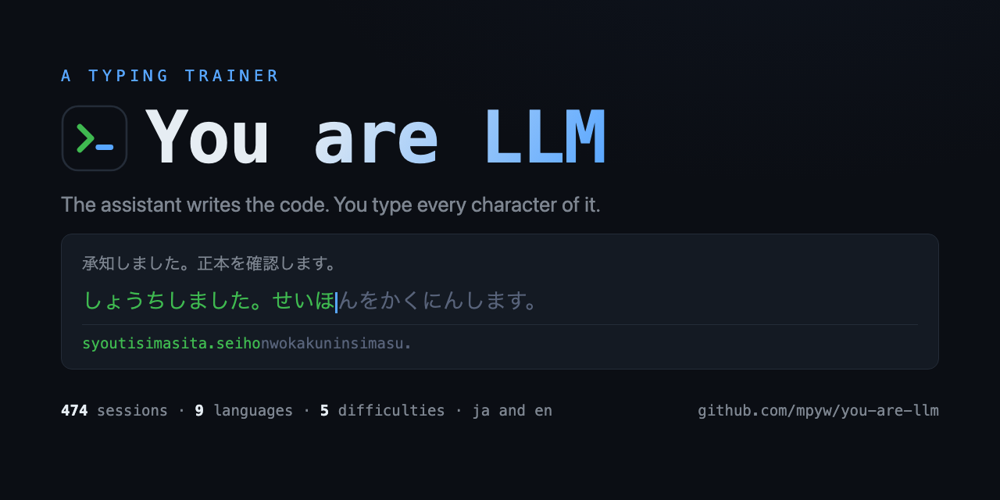
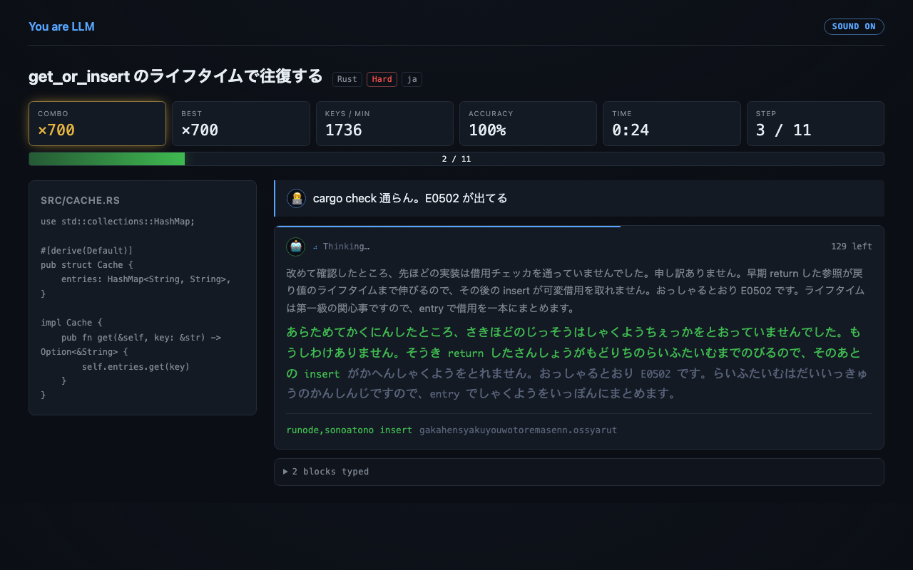
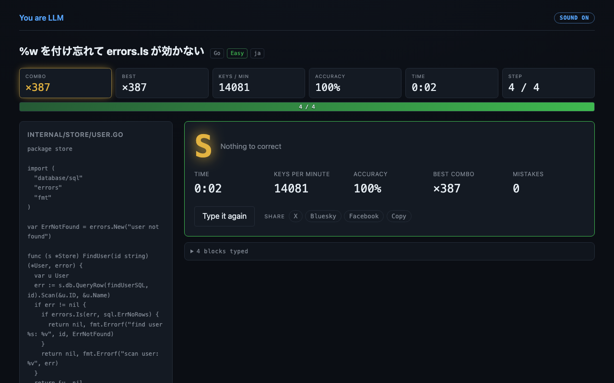
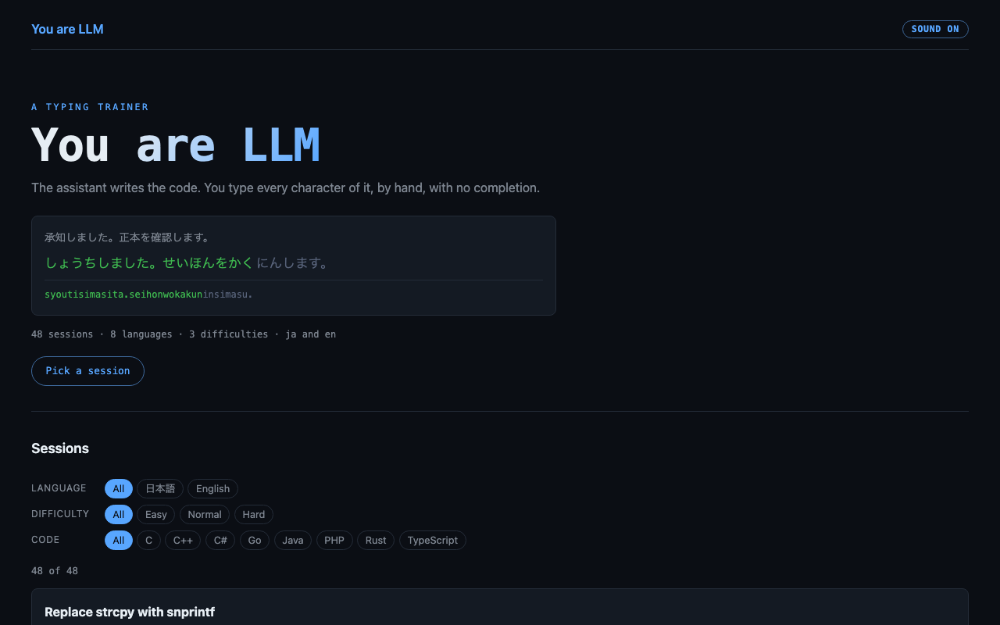

# You are LLM

**You type the LLM's side of a coding session. No completion. No shortcuts.**

## Status

The trainer runs end to end. 474 sessions cover nine programming languages and two natural
languages, graded from Easy to Expert+. AZIK is not implemented yet.

## Commands

| Command | What it does |
| --- | --- |
| `pnpm dev` | Start the dev server |
| `pnpm build` | Typecheck, then build into `dist/` |
| `pnpm test` | Run the tests |
| `pnpm lint` | Lint with type-aware rules |
| `pnpm check:material` | Check session JSON without running the suite |
| `pnpm typecheck` | Typecheck only |

## How a session runs

Pick a session, then type the assistant blocks one at a time. Every block is one run of the engine.
A block ends only when the whole target is typed.

The stage holds one block at a time. A finished block moves into a folded log rather than stacking
below the next one, so the page keeps its height and a small screen stays playable.

| You see | You type |
| --- | --- |
| The user prompt | Nothing. It is context |
| Japanese prose | Its kana reading, which an IME turns into the kanji |
| Code and shell commands | The characters as they stand |

Enter produces a newline, and Tab produces one step of indent. A key the engine rejects costs the
combo and nothing else.

Indent steps are measured from the session itself, so two space code takes one Tab per level and
four space code takes one Tab per level too. The spaces still work if you would rather type them.
Tab keeps moving focus everywhere else on the page, so it is only taken when an indent is actually
due.

The display tracks the run while it happens.

| Tile | What it counts |
| --- | --- |
| Combo | Accepted keys in a row. It turns gold past 25 and resets on a mistake |
| Best | The longest combo of the run |
| Keys / min | Accepted keys against elapsed time |
| Accuracy | Accepted keys against every press |

A finished session is graded from S down to D. Speed alone does not earn a rank, because each tier
has an accuracy floor as well.

The result carries a share row. X and Bluesky get the rank and the figures with the link, Facebook
takes the link alone because it accepts nothing else, and `Copy` puts both on the clipboard.

Cues are synthesised through Web Audio rather than loaded, so they cost nothing to ship and fire
with no delay. The key click climbs in pitch with the combo. `Sound on` in the header turns the lot
off, and the choice is remembered in the browser.

Each line carries who said it. The prompt sits behind a person, the block being typed behind a
robot, and the robot's line shows a spinner and a word that keeps changing while the block runs. It
is a nod to what every coding agent puts on screen while it works, in this project's own words.

> [!NOTE]
> Every animation is dropped under `prefers-reduced-motion`, and the spinner and its words stop
> changing as well.

## Social preview

`scripts/og.html` is the one template both preview images come from.
`docs/social-preview.md` holds the two commands and says where each image goes.

| Image | Size | Used by |
| --- | --- | --- |
| `public/og.png` | 1200 by 630 | The `og:image` tag on the site |
| `docs/social-preview.png` | 1280 by 640 | The repository preview, uploaded by hand |

## The input engine

`TypingSession` keeps every possible spelling alive at once. The typist never declares a reading.
The engine narrows the options as keys arrive.

| Target | Keys it accepts |
| --- | --- |
| `し` | `si`, `shi`, `ci` |
| `きゃ` | `kya`, `kixya`, `kilya` |
| `じゃ` | `zya`, `ja`, `jya`, `zixya` |
| `きって` | `kitte`, `kixtute`, `kiltute` |
| `にほん` | `nihonn`, `nihoxn`, `nihon'` |

Three rules do most of the work.

| Rule | Holds | Fails |
| --- | --- | --- |
| A bare `n` needs a consonant next | `kanzi` for `かんじ` | `kiniro` for `きんいろ` |
| `っ` doubles any consonant but `n` | `kitte` for `きって` | `anna` for `あっな` |
| A digraph never takes a single kana's spelling | `syi` for `しぃ` | `shi` for `しぃ` |

Characters outside the table are typed as themselves. That is what makes source code work as material.

> [!NOTE]
> Alternative layouts such as AZIK plug in through the `Layout` interface in `src/engine/types.ts`.
> The engine holds no table of its own.

## Material

Sessions are static JSON under `src/materials/sessions/`. Adding a file adds a session. Nothing
registers it. Every session is validated on load, so a bad field fails fast and names its position.

Each session sits on three axes.

| Axis | Values |
| --- | --- |
| Language | `ja`, `en` |
| Difficulty | `easy`, `normal`, `hard`, `expert`, `expertplus` |
| Code language | C, C++, C#, Go, Java, PHP, Python, Rust, TypeScript |

Difficulty is measured, not chosen. `scripts/typing-load.mjs` scores every session across the whole
set rather than within one language, so Rust mostly lands at Hard or above.

| Difficulty | Score | Sessions |
| --- | --- | --- |
| Easy | under 11 | 72 |
| Normal | 11 to 16 | 160 |
| Hard | 16 to 22 | 168 |
| Expert | 22 to 34 | 72 |
| Expert+ | over 34 | 2 |

The score is how hard a session is per keystroke, stretched a little by how much of it there is.

Hardness is the share of keys that need Shift, times the number of distinct symbol shapes the
session asks for. Shapes are what separate Rust from PHP. PHP types more symbols, but `$` and `->`
are most of them, learned once. Rust spends the same weight across `&mut`, `::`, `<'a>`, `?` and a
dozen others.

Length counts symbol keystrokes rather than all of them. A session is not harder for spelling out
`htmlspecialchars`, which is the easiest kind of key there is.

Rust mostly comes out at Hard or above. The exceptions are attributes on a type or one library
call. Java mostly comes out at Hard or below, and the exceptions are the ones whose `sed` is dense
with escapes or whose test setup is long. The only Expert+ session is the Rust `transaction` that
takes a closure.

The front page filters on all three, and a filtered view is a shareable URL. It opens on Japanese,
because that is what most of the material is for. `All` shows both languages and says so in the
address.

`src/materials/FORMAT.md` is the authoring guide. Read it before writing a session.

> [!IMPORTANT]
> A Japanese `text` block needs a `reading` in kana. The suite fails when a Japanese target holds a
> character no keyboard can produce, because no romaji sequence reaches it.

## Deployment

A push to `main` builds the site and publishes it through GitHub Pages. The workflow lints, tests
and builds before it deploys, so a red suite never reaches the site.

| Piece | Where |
| --- | --- |
| Workflow | `.github/workflows/deploy.yml` |
| Base path | `BASE` in `vite.config.ts` |
| Deep links | `404.html` and one page per session, from the `static-pages` plugin |

Every session also gets a real page written at build time, under both `/sessions/<id>` and
`/sessions/<id>/`, carrying its own title and description. A shared link used to fall through to
`404.html`, and a crawler handed a 404 shows no preview at all.

> [!NOTE]
> The domain comes from `mpyw/mpyw.github.io`, which owns `mpyw.me`. Project sites under the same
> account are served below it automatically. This repository holds no `CNAME` file.

## TypeScript 7 and ESLint

The app runs on TypeScript 7. typescript-eslint cannot.

| Package | Version here | Why |
| --- | --- | --- |
| `typescript` (root) | 7.0.2 | Compiles and typechecks the app |
| `typescript` (in `tools/eslint-config`) | 6.0.3 | The last release with the JavaScript compiler API |
| `typescript-eslint` | 8.70.0 | Pinned below the 8.70.1 supply-chain cutoff |

TypeScript 7 exports only `./lib/version.cjs` from its main entry. The old `ts.createProgram` API is
gone. typescript-eslint imports that API directly, so it needs a JavaScript build of TypeScript.

pnpm resolves a peer dependency per workspace package. So `tools/eslint-config` pins TypeScript 6.0.3
for itself, and the app keeps TypeScript 7. Both live in one repository.

> [!IMPORTANT]
> Never add `typescript-eslint` to the root `package.json`. It would resolve the root TypeScript 7 and
> break. Lint plugins belong in `tools/eslint-config`.

Run `pnpm lint` to confirm the split still works. Type-aware rules such as `no-floating-promises`
only fire when typescript-eslint has a working compiler.
